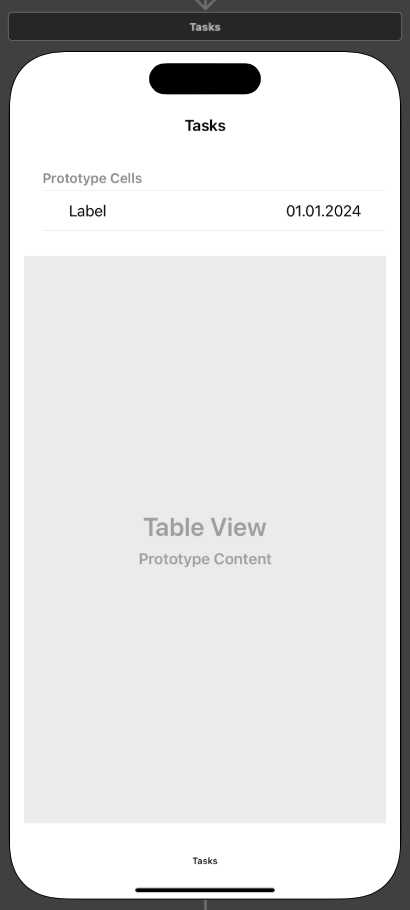

# Pixel Perfect Planner
#### Author: Philipp Haug
#### Video Demo: <https://youtu.be/SMraSUMq-DU>

## Descritpion
Pixel Perfect Planner is an IOS application that helps the user keep track of their tasks as well as habits and time allocation. It gives a statistical overview of the achievements of the user over the course of a year.

## Goals for the App
In this section the goals for the app defined pre developement are listed.

### Simple Task Checklist
The App should contain a page that displays tasks input by the user. It should display  the task title as well as a due date. Tasks shall be ticked of by the user.

### Ability to track Habits
The App should reliably track the users habits. This should function like a counter so in the overview of the year the user can see in a statistical way on which days or which phases of the year the user indulged in what habits.

### Ability to track time allocation per day
The App should reliably track the users time allocation. This should give the user the  ability to see where they spend a majority of their time over the course of the year and maybe deduce a corellation between the phases of the year.

### Good looking overview over the year and where youre time went or your habits
The overview of the year should look like a heatmap. Days represented by pixels shall be  colored according to the ammount of habits or times done that day.

## Description of the code
In this section is explained how the code is structured and how each of the goals where achieved. The Code of the App is structured in multiple swift files. Each of the files corresponds to one swift class In the following subsections each of the files will be explained by its function.

### Main - Storyboard
In the main storyboard the three screens were created. One for displaying the tasks, one for adding Tasks, Habits and Time and one for displaying the year. In the following picture is the whole storyboard displayed. The three screens are organized by a tabbar controller and each of the three main screens is wrapped in a navigation control. One the one hand does that make a secon screen per main screen possible as well as gives the opportunity to add good looking titles. 

#### Tasks Scene
The task scene is composed of one table view that stretches over the whole screen. The table view displays the tasks. Per cell there is a label for the title of the task, a label for the due date of the task and a button for checking the task of. In the following picture the task scene is displayed.

#### taskDaily Scene
In the taskDaily scene the selected task from the tasks scene is displayed in detail. Therefore the taskDaily scene is composed of multiple labels to display data like the title and the due date as well as a textfield to display the notes from the task. This textfield is disabled to prevent editing from the user. In the following picture the taskDaily scene is displayed. 

#### Add Scene
In the add scene is split into four segments using the segment control. The screen contains all of the needed components, but only the ones needed per segment are shwon by the code. First segment is to add a task by inputting the title, date and optional notes. Second segment is to add a habit selected by the pickerview. Third is to allocated time by selecting an option from the picker view and using two date pickers to set the start and end time. The fourth and last segment is to add new types of habits or time allocation. In the following picture the task scene is displayed. 

#### Year Scene
The Year Scene is composed of a pickerView to select the stat that the user wishes to be displayed, a legend (consisting of two views and two labels) to display the colorcoding and a collection view with one item per day colored in the correspoding color. In the following picture the task scene is displayed. 

#### Date Scene
By clicking on one of the items of the year scene the user is taken to the date scene. This is composed of the title telling the date and a label displaying all stats of the day. In the following picture the task scene is displayed. !(/PixelPerfectPlanner/mdAssets/dateScene.png)

### Task tracking
To track the tasks there were three swift files created. DailyVC.swift manages the setup and functions of the task view controller. taskCell.swift defines a custom class for the cells displayed on the view controller and adds the function of the buttons to it. dailyTaskDetail.swift manages and sets up the view controller of the detailed display of the tasks.

#### DailyVC.swift
The DailyVC is the initial view controller. After defining the outlet of the table view and the needed variables for all the tables in the database the view controller is loaded. Then all the tables in the database needed to run this app are created, if theyre not already existing. Next the function to look for and display the tasks "fetchTasksForToday" is run. This function is also run when the view appears to ensure proper updating when the user switches to the view via the tabbar controller.
The "fetchTasksForToday" function starts by connecting to the databse and filtering for all tasks that havent been done. These are written in a "tasksTable" array which will be used by the table view.
Then the segue to the detailed view of the task is defined in the code.
The table view is set up by using the "taskTable" array. The table view has the same length of the array and each cell is set up using the data from the array. The data is handed to the taskCell.swift class and the function to set up the cell is run.
Lastly the function to hide the keyboard by tapping somewhere else is defined.

#### taskCell.swift
At the beginning of the TaskCell class the outlets from the screen, as well as other variables needed in the class are defined. In the configure function the labels of the cells are set to display the title of the task as well as the due date and the function of the button is set. Next the function for tapping the button is defined. Here a connection to the database is made and is searched for the tapped task by its id. The status of said task is set to done. Immediatly after that the view controller displaying all the tasks is reloaded. As a last step of the button the completion of the task is added to the habittime table (similar to adding a habit). This makes it possible to show on the year screen how many tasks have been completed each day.

#### dailyTaskDetail.swift
The dailyTaskDetailVC class starts with getting the task structure from the segue. This is the selected task to display in detail on the corresponding screen. Next the outlets of the screens are defined. Upon loading the view the task variable is unwrapped and the data from the variable is displayed on the screen if the variable isnt empty.

### Add Tasks, Habits and Times - AddTaskVC.swift
In the code for the add task scene firstly the segment controller is defined. After that all the table schemas as well as all the outlets for the components for the four different segments are defined.
When loading the screen datasource and delegate of the picker views are set as well as the segment controller is defined.
Next the picker views are set up.
Upon changing the segment first all UI components are hidden and then the needed components per segment are loaded. For the "Habit" and "Time" segment the "updateDescrptPicker" function is run. In this function the database is opened and all habits or time allocation are put in the respective picker views.
When clicking the "add"-Button the add function is called. In this function depending on the segment a switch case is executed.

#### Adding a Task
First data is took from the input fields. If the title input is empty the border of the text field turns red and the function is exited.
Then the data is added to the tasks table in the database and the input fields are resettet.

#### Adding a Habit or Time
Adding a Habit or a time allocation works similar, except that instead of adding a actual time value the habit version of timeDuration in the habittime table works like a counter.
For adding a Habit or a time allocation the function "addHabitOrTime" is called. In this function the value of picker view is taken as well as the current date. Then the database is opened and the data is put in either under the "Habit" or "Time" type. To make sure theres only one line with that habit or time in the database the value is first searched for. If it exist the new time is added on top or the counter is upped. This ensures that the analysation of the database in the year as pixel portion of the app is considerably easier.
#### Add a type
To add a new type the value of the text field and the picker view is put in the habit table of the database as descritption and type respectively. The field is protected against nil input.

### Display the year as pixel
To display the year as pixel two swift files where created. The yearlyVC.swift manages the view controller for displaying the year scene with all the pixels. The dayOverviesVC.swift file defines the view controller for the screen that appears when the user clicks on a specific day.

#### YearlyVC.swift
First the schema for all the tables is importet. Then outlets and variables are defined. Here colorscale and calendar are set.
When the screen loads the datasource and delegate for both the collection view and the picker view are set. Then the legend is refined and the picker view is poulated by selecting all the descriptions of the habits and time allocations from the habit table. These are sorted so that "Task" is always the first.
This is again done when the screen appears so that the picker view is always upto date. Here called as well is the function "handlePickerSelection". This function updates the collection view with data from the database and the selected option from the picker view.
In the next couple functions the picker view is set up. Notably is that upon changing the view the "handlePickerSelection" function is called again to keep the in the collection view displayed data inline with the selected option.
The Funtion takes the row of the picker view as an input. From there the function retrieves the selected option and filters the database for that. Therefore all dates where a task has been fullfilled or a certain habit or time allocation has occured are stored in an array. The color scale is then set depending on the max and min values in the array. In the end of the function the collection view is reloaded.
Next this collection view is set up. There should be one section with exactly the amound of days in the current year.
Then the cells are created. For each cell it is looked in the array wether theres a corresponding date. If there is a date and a value stored in the array the respective color according to the scale is assigned by a switchcase. Otherwise the cell is returned grey.
In the following couple of functions the collection view specs are defined.
At the end of this class the segue to the dayOverviewVC-screen is defined. The dated of the clicked cell is transferred through the segue.

#### dayOverviewVC.swift
The definition of the viewcontroller starts by defining the outlet of the big label, to display the detailed stats and collect the dateCV vairable from the previous screen. Then other variables and the table schema for the habittime table are defined.
Upon loading the screen the dateCV variable is unwrapped, the screen title is set and the database is filtered to the selected date from the variable. All the data from the database from this date is selected and stored in an array.
The array is then converted into text and displayed on the screen.

### Other
In this section all other code files are mentioned and explained.

#### structDefinitions.swift
In the structDefinitions file the used structs for the project are defined.

#### extensions.swift
In the extensions.swift file one extension for the UIResponder is written. This ensures that the viewController DailyVC is loaded properly when ticking of a task.

#### RabioButton
Radio button was created by Shamas and downloaded from here: <https://github.com/shamasshahid/SSRadioButtonsController> . Upon loading it into the project some functions where throwing warnings because of the newer IOS version. These were either fixed by xCode or deleted from the code.
